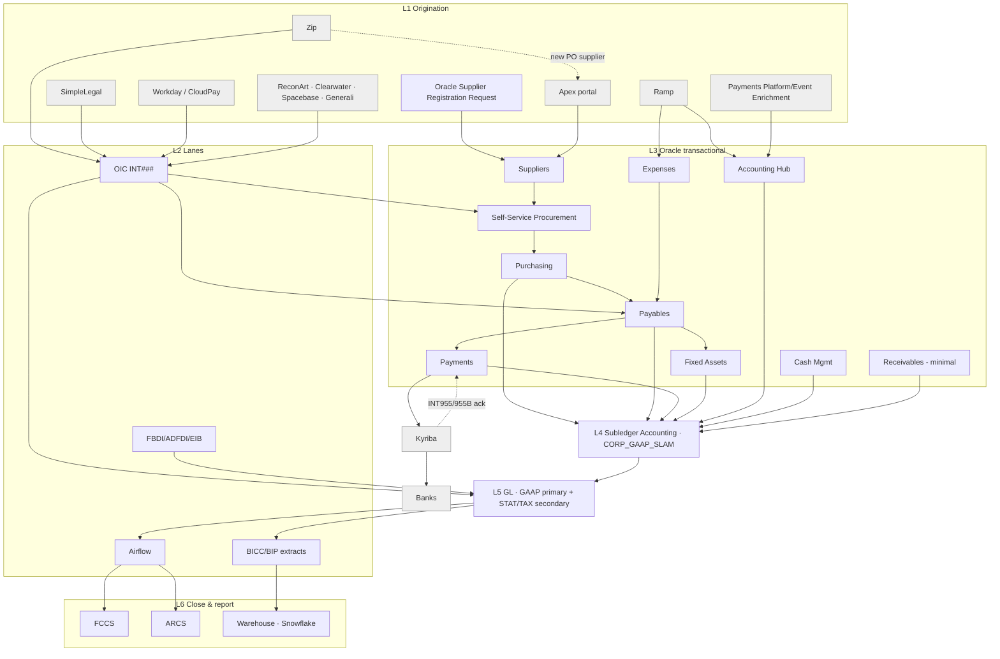

# The Estate in Six Layers

Read as a **narrowing**, top to bottom. `[CO:01-oracle-finance-spine §1]` (corrected for supplier onboarding `[USER:2026-09-29]`)

| # | Layer | Members |
|---|---|---|
| L1 | Systems of origination | Zip (intake/workflow), Apex portal (PO-supplier onboarding), Oracle Supplier Registration Request (non-PO supplier onboarding), Ramp + Oracle Expenses (T&E), Magnit/Upwork (contingent workforce), SimpleLegal (legal spend), Payments Platform via Event Enrichment (platform events), Workday + CloudPay (HR/payroll), ReconArt, Clearwater, Spacebase, Generali |
| L2 | Integration & orchestration | OIC (`INT###`), Airflow DAGs, FBDI/ADFDI/EIB, BICC/BI Publisher |
| L3 | Oracle Fusion transactional modules | Suppliers → Self-Service Procurement → Purchasing → Payables → Payments; Expenses; Tax; Cash Management; Receivables (minimal); Fixed Assets; Accounting Hub; Intercompany |
| L4 | Subledger Accounting (XLA) | Accounting method `CORP_GAAP_SLAM`; event classes → journal entry rule sets → journal line rules → account rules → mapping sets |
| L5 | General Ledger | `Corp_COA_Structure` (9 segments); GAAP primary ledger + STAT/TAX secondary ledgers; ledger sets |
| L6 | Close, reconcile, report | FCCS (`CORPCONS`), ARCS, OTBI, BI Publisher, Smart View, Essbase balances cube, Finance Warehouse warehouse, Snowflake, Tableau/Superset/internal BI, Anaplan/EPBCS |

Settlement exits L3 sideways: Oracle Payments → **Kyriba** → banks, with acknowledgements returning hourly (`INT955`, `INT955B`).

## Where commitment becomes accounting (P2P)
Stages 01–04 (onboarding, intake, requisition, PO) move a **commitment** without touching the ledger. Only
**receipt (accrual), invoice (liability) and payment (cash)** create accounting — all via XLA. `[CO:02 §1]`

## Two ways into the ledger (R2R)
- **Derived by XLA:** platform accounting (FAH sources) and Oracle subledgers.
- **Pre-accounted via Import Journals:** Workday, CloudPay, ReconArt, Clearwater, Spacebase, Kyriba GL, exchange-rate-driven feeds, FBDI/EIB/manual/spreadsheet journals, INT992 balancing, redenomination. `[CO:03 §1]`

## Scale anchors (for sanity-checking answers)
| Measure | Value | Source |
|---|---|---|
| Accounting events/day into FAH | 10–12M | `[CO:03 §3.2]` |
| FAH headers / lines per day | ~11M / ~40M | same |
| GL journal headers / lines / batches per day | ~700K / ~3.5M / ~80K | same |
| Daily platform run window / success | 5–7 hrs / ~99% | same |
| AP holds, rolling 12 mo to mid-Sep 2026 | 23,722 holds on 15,309 invoices, 3,569 suppliers, 31 LEs | `[CO:02 §4 Stage 06]` |
| FA asset books | 40+ | `[CO:03 §3.3]` |
| Journal feeders into GL | 19+ | `[CO:03]` |
