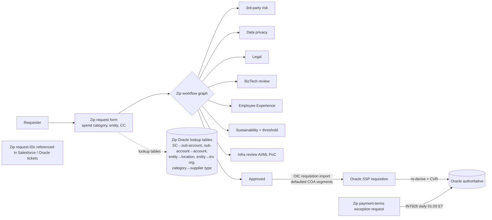

# Zip — System File

Status legend per section: **KNOWN** (sourced) · **PARTIAL** · **GAP** (needs a human source).

## 1. High-level system architecture — PARTIAL

| Component | Description | Evidence |
|---|---|---|
| Request intake | Every requester submission starts in Zip | `[CO:02 §4 Stage 02]` |
| Conditional review graph | TPRM, data privacy, legal, BizTech (professional services on BizTech CCs), Employee Experience (tech/software), sustainability above spend threshold, infrastructure review for AI/ML PoCs | same |
| COA defaulting | Three chained lookups + sibling lookups; *Zip Admin › Integrations › Oracle › Lookup Tables*, CSV bulk import | `[CO:02 §3, §7]` |
| Spend-category catalogue | Kept in step with Oracle sub-account values | `[CO:02 §4]` |
| Outbound to Oracle | OIC inbound requisition import (integration ID not documented) | `[CO:02 §6]` → Q-ZIP-1 |
| Payment-terms exceptions | Approved exceptions → INT826 | `[CO:02 §6]` `[USER:2026-09-29 schedule]` |
| PO supplier onboarding | New PO suppliers go Zip → **Apex portal** → Oracle Fusion; the supplier is available for POs only after Apex | `[USER:2026-09-30]`; Apex → Oracle via INT055A |

## 2. Workflow documentation — PARTIAL
Known node families listed above. **GAP:** node-by-node configuration (conditions, owners, SLAs, order, parallel vs serial) — source: Zip workflow builder export / "Zip architecture document and module/workflow descriptions". `[CO:02 §7]`

## 3. Integration mapping — PARTIAL
| Integration | Direction | Trigger | Key fields | Transformation | Status |
|---|---|---|---|---|---|
| Zip → Oracle requisition (OIC) | In | On approval | Supplier, spend category, LE, sub-BU, CC, account, sub-account, geo, project, lines | Oracle re-derives charge account via TAB; Redwood validations; CVRs | Field map GAP |
| INT826 payment-terms exceptions | In | Daily 01:00 ET | Zip Request Id, Vendor Id, Exception Level (SUP/PO/INV), Current/New Payment Terms, PO Number, Invoice Number, Installment | Resolves target in Fusion by level; see `integrations/INT826.md` | KNOWN (log schema) |
| Zip → Apex → Oracle supplier (INT055A) | In | Every 30 min (Apex *Pending ERP*) | VR_ID, CompanyNameDBA, Registered Name, addresses + purpose flags, company codes, bank accounts, tax IDs, certifications, attachments, SimpleLegal legal-supplier flag (FIN-22640) | Create/update by ERP Unique ID; sites via enterprise-structure crosswalk; see `integrations/INT055A.md` | KNOWN (spec) |
| Zip lookups ← Oracle master data | In (manual CSV) | On change | SC, sub-account, account, entity, location, inv org, supplier type | CSV bulk import | Process KNOWN, owner GAP |

## 4. Roles and responsibilities — GAP
No source lists Zip roles/permissions. Needed: Zip admin roles, workflow admins, integration service account, approver roles.

## 5. ITGC narrative — GAP
Needed: access provisioning/deprovisioning, change management (Jira intake tickets govern changes `[CO:02 §4]`), integration monitoring (OIC `PROD | ERROR` tickets for Zip-fed INTs), backup/SOC reports. Template reference: Kyriba ITGC narrative (not in folder).

## 6. Configuration guide — PARTIAL
Lookup tables (location, CSV import), workflow builder, spend-category catalogue, request form fields. Vendor-delivered vs custom settings: GAP.

## Known failure modes `[CO:02 §4 Stage 02]`
- Requisition not sent to Oracle because spend category inactive/absent in Oracle.
- Wrong LE or CC chosen at intake → discovered after PO exists → cancel and restart.
- Workflow delays in TPRM and privacy sub-processes.
- Spend category not appearing during line editing.
- INT826 user-entry errors (REQ number instead of PO, missing `PO` prefix, notes in invoice field) — ~40% of INT826 rows fail as "No record found in Fusion". `[DATA:int826 logs]`

## Design consequences an agent must apply
- A Zip lookup change alone never fixes a mis-posted cost (R1). Compare Zip-sent vs Oracle-stored first.
- A new spend category = Zip lookup + Oracle sub-account value (+ CVR if newly legal) — minimum two systems.
- Field validations in Zip that depend on Oracle master data can't move to Zip without giving Zip that data.

## In flight (not architecture)
Buyer review moving from Oracle to Zip; Zip MCP use case; Zip-to-Salesforce integration evaluation.
