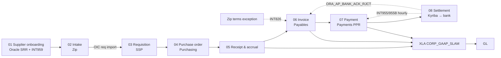

# Procure to Pay — Eight Stages

**Defining property:** *Zip orchestrates, Oracle decides.* Stages 01–04 move a commitment; 05–07 create accounting; 08 settles and returns status. `[CO:02 §1]`

Note: two onboarding paths — PO suppliers are onboarded Zip → Apex → Oracle before a PO can be raised `[USER:2026-09-30]`; ad hoc/non-PO suppliers are created directly via SRR + INT959.

## Stage cards

### 01 Supplier onboarding — see `supplier-onboarding.md`
PO path: Zip → Apex portal → Oracle Suppliers via **INT055A** (every 30 min; see `integrations/INT055A.md`). Non-PO path: Oracle SRR + INT959. Accounting: none.

### 02 Intake — Zip
| Field | Value |
|---|---|
| Trigger | Requester submits Zip request |
| Work | Conditional review graph (TPRM, privacy, legal, BizTech, EX, sustainability, infra); COA segment defaulting via lookups |
| Output | Approved request → OIC requisition import |
| Control | None in SOX scope yet (advisory) |
| Failure modes | Inactive/absent spend category in Oracle → req never arrives; wrong LE/CC → cancel & restart after PO; workflow delays |
`[CO:02 §4 Stage 02]`

### 03 Requisition — SSP
| Field | Value |
|---|---|
| Trigger | OIC import of approved Zip request |
| Work | Charge account re-derived (TAB `[ORA26C:implementing-procurement p.648]`); Redwood validations at submit (`*_VAL`); CVRs; spend approval matrix by CC / sub-SBU |
| Output | Approved requisition |
| Control | First point in SOX scope |
| Integrations | INT101 → Mulesoft; INT270 → Salesforce; REP701 |
| Failure modes | Approval needs manual re-trigger; approver on leave/terminated; CVR rejects a Zip-valid combo; approver/CC-owner changes as individual requests |
`[CO:02 §4 Stage 03]`

### 04 Purchase order — Purchasing
| Field | Value |
|---|---|
| Work | Req → PO; buyer review in Oracle; change orders by Procurement Ops from Jira; FBDI for bulk |
| Failure modes | Hundreds of duplicate change-order notifications; funds transfer between lines fails; stale requester blocks invoice approval/payment; BICC PO-line blank files |
`[CO:02 §4 Stage 04]`

### 05 Receipt & accrual
First accounting event (accrual); third leg of 3-way match; INT026F variable accrual; INT026B; REP577 not-reversed alert. Failure: duplicate variable accruals; accrual not reversed. `[CO:02 §4 Stage 05]`

### 06 Invoice — Payables
Intake via Jira AP desk, SimpleLegal (INT301A/B), Generali (INT062A), Oracle Expenses reimbursements. Matching + tolerances → holds (dominant workload; 23.7K holds/yr). INT960 non-PO >5K; INT826 terms exceptions. Failure: monthly tolerance recalculation (audit risk); INT826 hitting cancelled/paid invoices; prepaid GL validation errors; supplier-level hold blocks all unvalidated invoices. `[CO:02 §4 Stage 06]` → `oracle-modules/payables.md`

### 07 Payment — Payments
PPR against template per LE + bank account → file to Kyriba. Standard auto-approved in Kyriba; urgent/one-time via Urgent Payment Tool, released manually by Treasury. Failure: wrong GL account for entity; re-processing requires rejecting the original first; urgent desk failures; void/method changes manual. `[CO:02 §4 Stage 07]`

### 08 Settlement — Kyriba → bank → Oracle
Two mappings in Kyriba; H2H transmission; INT955 hourly acks; INT955B records rejections on payment DFFs; rejected payments voided manually; INT246 Kyriba → GL; INT819/820 statements. Failure: **stuck in Draft** (silent); file not integrated (field length, e.g. payment reason); bank rejects (BIC vs ABA, branch/routing/convenio); account not H2H-enabled; missing statements. `[CO:02 §4 Stage 08]` → `payments-settlement-and-returns.md`

## Cross-cutting processes
- **Invoice tolerance maintenance** (monthly, FTG). `[CO:02 §5]`
- **Approval continuity** — delegation/reassignment across Oracle, Zip, Ramp, Magnit, Upwork (separate matrices). `[CO:02 §5]`
- **Supplier inactivation / third-party offboarding** — Oracle-side inactivation is part of offboarding. `[CO:02 §4 Stage 01]` Cadence and owner not documented → Q-SUP-2.
- **SoD analysis** — periodic inter-role analysis, findings triaged by FTG / service accounts / business users. `[CO:02 §5]`
- **New legal entity / cost center fan-out** — `master-data-fanout.md`.
